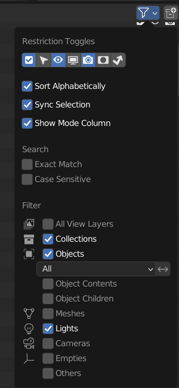

.. _gmod_vanilla:

Garry's Mod Vanilla
===================

| Throughout this page, you'll find clickable text where a link is provided. Just click on it or right click and 'Open in new tab' to see the contents.
| Depending on the category you'll find multiple methods or only one. Where there are multiple methods (Such as in the :ref:`gmod_v_mapsandprops` Section), the benefits and drawbacks of both will be listed. Places where there's only one method means that the other method just wasn't as good/worth it, or there only is one way to do it.
| It's best if you have an up-to-date copy of Garry's Mod installed as nearly all of these methods will be relying on obtaining files present from within the game.

.. contents:: Table of Contents
    :depth: 3

.. _gmod_v_map:

Maps and included props
-----------------------

.. note::
    If you know the Team Fortress 2 methods for bringing maps in, it is exactly the same process here except the location is changed to ``[game_directory] / garrysmod / maps`` instead of ``[game_directory] / tf / maps``. The fully detailed guide has still been listed here, similar to the :ref:`tf2_vanilla` section, as some users may not be experienced with Team Fortress 2 and may only be interested in Garry's Mod. This is why you will find the instructions here and on that page to be extremely similar, as they're the same process.
    
| :ref:`gmod_v_map_method1` uses three tools, all linked in that section. This method is recommended as it makes the maps significantly easier to work with. All imported items are organized into collections and very easy to work with and customize.
| :ref:`gmod_v_map_method2` uses only one addon, called SourceIO. It's a one click solution and way easier than :ref:`gmod_v_map_method1` , but the names of objects becomes messy, and there's extra cleanup required as extra objects such as the map hitbox is also imported. It's closer in looks to Gmod as it uses its own shader, so if you want the true Gmod look, then use this. :ref:`gmod_v_map_method1` also works fine but is better suited for applying your own style or flair to your renders and animations. 
| Both methods require a fully working copy of Garry's Mod and a recent copy of Blender. If you are unable to get these methods to work, it is recommended to use the latest version of Blender.

.. _gmod_v_map_method1:

Method 1 (Recommended)
^^^^^^^^^^^^^^^^^^^^^^

.. _gmod_v_map_method1_summary:

Summary of Method 1
"""""""""""""""""""

*    Download BSPSource, Plumber, and Blender Source Tools. Install Plumber and Blender Source Tools as Add-ons into Blender (This step is only necessary on first time use).
*    Locate the map you wish to bring into Blender by going to ``[game_directory] / garrysmod / maps``.
*    Repack the ``.BSP`` file using ``EspionRepacker`` if necessary.
*    Convert the ``.BSP`` file into a ``.VMF`` file using BSPSource.
*    Import the ``.VMF`` file from :guilabel:`File` > :guilabel:`Import` > :guilabel:`Plumber` > :guilabel:`Valve Map Format (.vmf)` in Blender.
*    Disable all lights except ``light_environment``, and set Color Profile from :guilabel:`Filmic` to :guilabel:`Standard`.

.. _gmod_v_map_method1_detailed:

Full Guide of Method 1
""""""""""""""""""""""

.. note::
    Always get the most recent version of a program or Add-on linked here.

| `Blender Source Tools <http://steamreview.org/BlenderSourceTools>`_, `BSPSource <https://developer.valvesoftware.com/wiki/BSPSource>`_, and `Plumber <https://github.com/lasa01/io_import_vmf/releases>`_ will be used for Method 1. The steps to install these can be seen at the :ref:`installingprograms` section. 
| Plumber was originally called io_import_vmf, and it's by the same developers. It's currently in Beta but significantly superior to io_import_vmf and that's why we've linked the page to download that instead.

| To start off, we need to make sure the map is even usable in the first place. Some maps are compressed beyond readability for BSPSource (Usually newer ones). To fix that, you need to repack it.

.. _gmod_v_fix_compressed_bsp:

Repack compressed .BSP files
""""""""""""""""""""""""""""

.. note::

    | These steps are only to be followed in case a .BSP file was too compressed for BSPSource. If you're unsure, better to do it anyways.
    | Make sure to follow the steps in the right order. 

*    Go to the releases page for `EspionRepacker <https://github.com/spy-ware/EspionRepacker/releases>`_ and download the latest version (don't download the one called Source Code).
*    For the BSPZip folder, go to ``[game directory] / bin``.
*    For the map you want to Repack, go to ``[game directory] / garrysmod / maps`` and choose the specific ``.BSP`` file (Map file) you want to Repack.
*    The output folder is of your own choice, but make sure it's a place you can come back to easily.
*    Click on :guilabel:`Repack` to repack your file. A folder will be generated called ``out``, and within this folder will be the ``.BSP`` file, ready to use for the next steps. 

.. _gmod_v_convert_bsp_to_vmf:

Convert a .BSP to .VMF
""""""""""""""""""""""

.. important::

    You need to install `Java <https://www.java.com/download/ie_manual.jsp>`_ to run BSPSource.

*    Download `BSPSource <https://developer.valvesoftware.com/wiki/BSPSource>`_ and extract all files to a folder.
*    Open ``bspsrc.jar`` from this folder.
*    There's many options in the program. For now, just click the button for :guilabel:`Add`. From there, if you repacked a file using EspionRepacker, go to the folder where the Output file is (the one which is a ``.BSP`` file) and select it. Otherwise, go to ``[game_directory] / garrysmod / maps`` and choose the specific map file you want to convert (these are also ``.BSP`` files).
*    Go to the :guilabel:`Other` tab in BSPSource, and enable the checkbox labelled :guilabel:`Extract Embedded Files`.
*    Once done, just click the :guilabel:`Decompile` button in the bottom right. There's no need to edit the other settings, though you're free to play around if you know what you're doing.
*    A file browser will show up for where to put the ``.VMF`` file. You can choose any location, but it's best if it's a place you can easily come back to.
*    Click on :guilabel:`Decompile`.

| Your .VMF file has now been decompiled and is in your output folder. You'll notice another folder in that location with the same name as the ``.VMF`` file. We'll use this later. If such a folder doesn't exist, then don't worry about it.

.. important::

    During the time that BSPSource is Decompiling the map, it will show logs of what it's doing. There is an ``Errors & Warnings`` box visible. This should be completely empty. If at any point something is shown in this box, then the process failed and needs to be done again. 

.. _gmod_v_importing_vmf:

Bringing The Map In
"""""""""""""""""""

| You can now import a .VMF file from the :guilabel:`File` > :guilabel:`Import` > :guilabel:`Plumber` > :guilabel:`Valve Map Format (.vmf)` button (Make sure Plumber and Blender Source Tools are installed). Browse to the location you stored your ``.VMF`` file which you Decompiled using BSPSource earlier. 
*    Make sure that in the Import settings, the game is set to Garry's Mod.
*    In the folder space underneath the :guilabel:`Game`, type the name of the folder with the same name as the ``.VMF``. If you don't have such a folder, you can skip this step.
*    Then click the ``.VMF`` file, and click :guilabel:`Import`. That's it, you should have everything. 

| The installation steps are not necessary to do again. It's really just as simple as, Repack ``.BSP`` if needed, Turn into ``.VMF`` with BSPSource, Bring ``.VMF`` into Blender.
| Go to :ref:`gmod_v_finishing_touches` for advice on clean up and additional useful things to know about within Blender regarding these maps.
| If you wish to familiarize yourself with the whole process, or see an overview, a :ref:`gmod_v_map_method1_summary` is written which you can refer to.
| If any problems occur you can ask for help on the `TF2 Blender Discord server <https://discord.gg/zHC2gJW>`_.

.. _gmod_v_map_method2:

Method 2 (Alternate)
^^^^^^^^^^^^^^^^^^^^

.. _gmod_v_map_method2_summary:

Summary of Method 2
"""""""""""""""""""

*    Download SourceIO and install it as an Add-on into Blender (This step is only necessary for first time use).
*    Go to :guilabel:`File` > :guilabel:`Import` > :guilabel:`Source Engine Assets` > :guilabel:`Source Map (.bsp)` in Blender.
*    Locate the map you wish to bring into Blender under ``[game_directory] / garrysmod / maps``.
*    Select everything by pressing A, then Shift Click an ``Empty``.
*    Press N under the 3D Viewport to open the sidebar, go to SourceIO, and click :guilabel:`Load Entity`.
*    Disable all lights except ``light_environment``, and set Color Profile from :guilabel:`Filmic` to :guilabel:`Standard`.

.. _gmod_v_map_method2_detailed:

Full Guide of Method 2
""""""""""""""""""""""

`SourceIO <https://github.com/REDxEYE/SourceIO>`_ will be used for :ref:`gmod_v_map_method2_detailed`. The steps to install these can be seen at the :ref:`installingprograms` section.

.. _gmod_v_importing_bsp:

Bringing the Map in
"""""""""""""""""""

.. important::

    Carefully follow these instructions. If you make a mistake, you will have to create a new, blank, project, as this addon directly reads off the ``.BSP`` in real time and doesn't allow that file to be changed or edited. There's also a lot of cleanup work to be done so, it's recommended to have a completely empty Scene for this process.

*    Go to :guilabel:`File` > :guilabel:`⤓ Import` > :guilabel:`Source Engine Assets` > :guilabel:`Source map (.bsp)` (Make sure SourceIO is installed).
*    Select your map of choice. The map **MUST** be in your Gmod game directory. It will be in ``[game_directory] / garrysmod / maps``. You can use the name filter to narrow down the results. 

| Once loaded in, maps will be quite bare-bones. The lighting will most likely be too dark, and the props aren't there. There are a few things to set up.
*    Press A to select all objects within the viewport. Then Shift Click on an ``Empty``. 
*    An ``Empty`` is a placeholder. You'll notice a lot of these in places where Props are supposed to be.
*    Everything should be selected, with an ``Empty`` being highlighted as Orange. 
*    Hovering over the 3D Viewport, press :guilabel:`N` to open the side panel. There will be a :guilabel:`SourceIO` tab. Click on that to open it.
*    Click on :guilabel:`Load Entity`.
*    It might take some time so please be patient. If done right, all props should show up without any error messages.

| The names of the props will be a huge mess, and every single prop will end up having its own Collection. For this reason, :ref:`gmod_v_map_method1` is recommended, but otherwise, the overall Map and the Props on the map are pretty much the exact same.
| The lighting is going to appear strange because in Eevee (Blender's default render engine) has a maximum of 128 lights. Filter the Outliner (the place where all objects and things in the scene are shown) by lights with the following settings:

.. seealso::
    For a full list of Eevee's limitations, you can consult `this page <https://docs.blender.org/manual/en/latest/render/eevee/limitations.html>`_ from Blender's official manual. 

.. _gmod_v_finishing_touches:

Finishing Touches (Both Methods)
""""""""""""""""""""""""""""""""

* Use :guilabel:`Material Preview` mode to confirm that all materials are actually fully functional before you do anything else. All textures should be visible and no part of the map should be white.
* Use Eevee if you want a true Garry's Mod look. Cycles will get you very different results.
* There's unfortunately a limit of Eevee which there's no way around. It can only have 128 active lights at once, while maps can end up having more than that. Unfortunately the only way around this is to use Cycles, which doesn't have a light limit, but another alternative is to maintain the majority of the look by turning off every light except the one which starts with the name ``light_environment``. This is the 'Sun' light and is responsible for nearly all outdoor lighting and shadows present on the map.
* If you want more accurate Garry's Mod colors, go to Color Management, and set the Color Profile from :guilabel:`Filmic` to :guilabel:`Standard`.

.. _gmod_v_prop:

Individual Props
----------------

| This section is written as a way to obtain individual props that are universally used in maps stored in Gmod files, such as Barrels. Some maps will have props that aren't used universally, and are exclusive to them. In this case it's best to just import the map, find the prop, and separate it.

.. _gmod_v_prop_method1:

Method
^^^^^^

.. _gmod_v_prop_method1_summary:

Summary of Method
"""""""""""""""""

*    Download GCFScape, and SourceIO. Install SourceIO into Blender (This step is only necessary on first time use).
*    Use GCFScape to extract the necessary files from ``garrysmod_dir.vpk`` into ``[game_directory] / garrysmod`` (This step is only necessary on first time use).
*    Use SourceIO to import ``.MDL`` file of choice from the extracted folders.

.. _gmod_v_prop_method1_detailed:

Full Guide of Method
""""""""""""""""""""

| The process is rather simple, it only requires a bit of setup, then the importing of the prop should be doable with a few clicks.
*    Download `GCFScape <https://nemstools.github.io/pages/GCFScape-Download.html>`_, and `SourceIO <https://github.com/REDxEYE/SourceIO>`_. Install SourceIO into Blender (installation guide listed in :ref:`installingprograms`)
*    Go to ``[game_directory] / garrysmod`` and open the file called ``garrysmod_dir.vpk``. It should open through GCFScape.
*    In GCFScape, right Click the ``Models`` folder, click :guilabel:`Extract`, and Extract it to ``[game_directory] / garrysmod``. Don't drag and drop as it is laggy and can bug out.
*    Then in GCFScape, Extract the folder called ``Materials`` to ``[game_directory] / garrysmod`` as well.
| All of that was for setting things up. Once that's completed, all you have to do for bringing a Model in is to open Blender, click :guilabel:`File` > :guilabel:`⤓ Import` > :guilabel:`Source Engine Assets` > :guilabel:`Source model (.mdl)`, and choose the ``.MDL`` file you're after inside the ``Models`` folder. It should have textures set up and everything. The above steps don't have to be repeated.

.. _gmod_v_characterandrig:

Character and Rig
-----------------

| Follow the initial steps for setting up :ref:`gmod_v_prop`.
| The ``.MDL`` files are all present under ``[game_directory] / garrysmod / models``. Just use SourceIO to bring in the one you want. Click :guilabel:`File` > :guilabel:`⤓ Import` > :guilabel:`Source Engine Assets` > :guilabel:`Source model (.mdl)`, and choose the ``.MDL`` file you're after. If you import a character, they should have a rig and textures set up.

.. _gmod_v_animations:

Animations
----------

| WIP
    
.. _gmod_v_weaponsandcosmetics:

Weapons and Cosmetics
---------------------

| Follow the initial steps for setting up :ref:`gmod_v_prop`.
| The ``.MDL`` files are all present under ``[game_directory] / garrysmod / models``. Just use SourceIO to bring in the one you want. Click :guilabel:`File` > :guilabel:`⤓ Import` > :guilabel:`Source Engine Assets` > :guilabel:`Source model (.mdl)`, and choose the ``.MDL`` file you're after. The weapon should have a rig and textures set up.

.. _gmod_v_soundeffectsvoices:

Sound effects & Voice lines
---------------------------

| Download `GCFScape <https://nemstools.github.io/pages/GCFScape-Download.html>`_. With GCFScape, open ``garrysmod_dir.vpk`` and browse the ``Sound`` folder. Extract the files you need.
