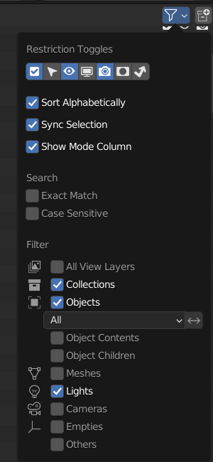

.. _tf2_v_map:

Maps and included props
-----------------------

| :ref:`tf2_v_map_method1` uses three tools, all linked in that section. This method is recommended as it makes the maps significantly easier to work with. All imported items are organized into collections and very easy to work with and customize.
| :ref:`tf2_v_map_method2` uses only one addon, called SourceIO. It's a one click solution and way easier than :ref:`tf2_v_map_method1`, but the names of objects becomes messy, and there's extra cleanup required as extra objects such as the map hitbox is also imported. It's closer in looks to TF2 as it uses its own shader, so if you want the true TF2 look, then use this. :ref:`tf2_v_map_method1` also works fine but is better suited for applying your own style or flair to your renders and animations. 
| Both methods require a fully working copy of Team Fortress 2 and a recent copy of Blender. If you are unable to get these methods to work, it is recommended to use the latest version of Blender.

.. _tf2_v_map_method1:

Method 1 (Recommended)
^^^^^^^^^^^^^^^^^^^^^^

.. _tf2_v_map_method1_summary:

Summary of Method 1
"""""""""""""""""""

*    Download BSPSource, Plumber, and Blender Source Tools. Install Plumber and Blender Source Tools as Add-ons into Blender (This step is only necessary on first time use).
*    Locate the map you wish to bring into Blender by going to ``[game_directory] / tf / maps``.
*    Convert the ``.BSP`` file into a ``.VMF`` file using BSPSource.
*    Import the ``.VMF`` file from :guilabel:`File` > :guilabel:`Import` > :guilabel:`Plumber` > :guilabel:`Valve Map Format (.vmf)` in Blender.
*    Disable all lights except ``light_environment``, and set Color Profile from :guilabel:`Filmic` to :guilabel:`Standard`.

.. _tf2_v_map_method1_detailed:

Full Guide of Method 1
""""""""""""""""""""""

.. note::
    Always get the most recent version of a program or Add-on linked here.

| `Blender Source Tools <http://steamreview.org/BlenderSourceTools>`_, `BSPSource <https://developer.valvesoftware.com/wiki/BSPSource>`_, and `Plumber <https://github.com/lasa01/io_import_vmf/releases>`_ (only download a release, pre-releases may be unreliable) will be used for Method 1. The steps to install these can be seen at the :ref:`installingprograms` section. 
| Plumber was originally called io_import_vmf, and it's by the same developers. It's currently in Beta but significantly superior to io_import_vmf and that's why we've linked the page to download that instead.

.. _tf2_v_convert_bsp_to_vmf:

Convert a .BSP to .VMF
""""""""""""""""""""""

.. important::

    You need to install `Java <https://www.java.com/download/ie_manual.jsp>`_ to run BSPSource.

*    Download `BSPSource <https://developer.valvesoftware.com/wiki/BSPSource>`_ and extract all files to a folder.
*    Open ``bspsrc.jar`` from this folder.
*    There's many options in the program. For now, just click the button for :guilabel:`Add`. From there, go to ``[game_directory] / tf / maps`` and choose the specific map file you want to convert.
*    Go to the :guilabel:`Other` tab in BSPSource, and enable the checkbox labelled :guilabel:`Extract Embedded Files`.
*    Once done, just click the :guilabel:`Decompile` button in the bottom right. There's no need to edit the other settings, though you're free to play around if you know what you're doing.
*    A file browser will show up for where to put the ``.VMF`` file. You can choose any location, but it's best if it's a place you can easily come back to.
*    Click on :guilabel:`Decompile`.

| Your .VMF file has now been decompiled and is in your output folder. You'll notice another folder in that location with the same name as the ``.VMF`` file. We'll use this later. If such a folder doesn't exist, then don't worry about it.

.. important::

    During the time that BSPSource is Decompiling the map, it will show logs of what it's doing. There is an ``Errors & Warnings`` box visible. If the process worked, then this box should be mostly empty. If [Warning] is shown in this, then it should be fine. If an [Error] is shown in this, however, then it may have failed. You'll have to come back to this step if the map doesn't work later. 

.. _tf2_v_importing_vmf:

Bringing The Map In
"""""""""""""""""""

| You can now import a .VMF file from the :guilabel:`File` > :guilabel:`Import` > :guilabel:`Plumber` > :guilabel:`Valve Map Format (.vmf)` button (Make sure Plumber and Blender Source Tools are installed). Browse to the location you stored your ``.VMF`` file which you Decompiled using BSPSource earlier. 
*    Make sure that in the Import settings, the game is set to Team Fortress 2. 
*    Set the Scale to be set to 0.1, and the Light Brightness set to 10. This is so the map is compatible with the Hisanimations Characters port and TF2 Collections Port.
*    In the folder space underneath the :guilabel:`Game`, type the name of the folder with the same name as the ``.VMF``. So if for example, your map file is called ``pl_pier_d.vmf`` then there should also be a folder called ``pl_pier_d``. Write ``pl_pier_d`` in that space. If you don't have such a folder, you can skip this step.
*    Then click the ``.VMF`` file, and click :guilabel:`Import`. That's it, you should have everything. 

| The installation steps are not necessary to do again. It's really just as simple as, Repack ``.BSP`` if needed, Turn into ``.VMF`` with BSPSource, Bring ``.VMF`` into Blender.
| Go to :ref:`tf2_v_finishing_touches` for advice on clean up and additional useful things to know about within Blender regarding these maps.
| If you wish to familiarize yourself with the whole process, or see an overview, a :ref:`tf2_v_map_method1_summary` is written which you can refer to.
| If any problems occur you can ask for help on the `TF2 Blender Discord server <https://discord.gg/zHC2gJW>`_.

.. _tf2_v_map_method2:

Method 2 (Alternate)
^^^^^^^^^^^^^^^^^^^^

.. _tf2_v_map_method2_summary:

Summary of Method 2
"""""""""""""""""""

*    Download SourceIO and install it as an Add-on into Blender (This step is only necessary for first time use).
*    Go to :guilabel:`File` > :guilabel:`Import` > :guilabel:`Source Engine Assets` > :guilabel:`Source Map (.bsp)` in Blender.
*    Locate the map you wish to bring into Blender under ``[game_directory] / tf / maps``.
*    Select everything by pressing A, then Shift Click an ``Empty``.
*    Press N under the 3D Viewport to open the sidebar, go to SourceIO, and click :guilabel:`Load Entity`.
*    Disable all lights except ``light_environment``, and set Color Profile from :guilabel:`Filmic` to :guilabel:`Standard`.

.. _tf2_v_map_method2_detailed:

Full Guide of Method 2
""""""""""""""""""""""

`SourceIO <https://github.com/REDxEYE/SourceIO>`_ will be used for :ref:`tf2_v_map_method2_detailed`. The steps to install these can be seen at the :ref:`installingprograms` section.

.. _tf2_v_importing_bsp:

Bringing the Map in
"""""""""""""""""""

.. important::

    Carefully follow these instructions. If you make a mistake, you will have to create a new, blank, project, as this addon directly reads off the ``.BSP`` in real time and doesn't allow that file to be changed or edited. There's also a lot of cleanup work to be done so, it's recommended to have a completely empty Scene for this process.

*    Go to :guilabel:`File` > :guilabel:`⤓ Import` > :guilabel:`Source Engine Assets` > :guilabel:`Source map (.bsp)` (Make sure SourceIO is installed).
*    Select your map of choice. The map **MUST** be in your TF2 game directory. It will be in ``[game_directory] / tf / maps``. You can use the name filter to narrow down the results. 

| Once loaded in, maps will be quite bare-bones. The lighting will most likely be too dark, and the props aren't there. There are a few things to set up.
*    Press A to select all objects within the viewport. Then Shift Click on an ``Empty``. 
*    An ``Empty`` is a placeholder. You'll notice a lot of these in places where Props are supposed to be.
*    Everything should be selected, with an ``Empty`` being highlighted as Orange. 
*    Hovering over the 3D Viewport, press :guilabel:`N` to open the side panel. There will be a :guilabel:`SourceIO` tab. Click on that to open it.
*    Click on :guilabel:`Load Entity`.
*    It might take some time so please be patient. If done right, all props should show up without any error messages.

| The names of the props will be a huge mess, and every single prop will end up having its own Collection. For this reason, :ref:`tf2_v_map_method1` is recommended, but otherwise, the overall Map and the Props on the map are pretty much the exact same.
| The lighting is going to appear strange because in Eevee (Blender's default render engine) has a maximum of 128 lights. Filter the Outliner (the place where all objects and things in the scene are shown) by lights with the following settings:

.. seealso::
    For a full list of Eevee's limitations, you can consult `this page <https://docs.blender.org/manual/en/latest/render/eevee/limitations.html>`_ from Blender's official manual. 

.. _tf2_v_finishing_touches:

Finishing Touches (Both Methods)
^^^^^^^^^^^^^^^^^^^^^^^^^^^^^^^^

* Use :guilabel:`Material Preview` mode to confirm that all materials are actually fully functional before you do anything else. All textures should be visible and no part of the map should be white.
* Use Eevee if you want a true TF2 look. Cycles will get you very different results.
* There's unfortunately a limit of Eevee which there's no way around. It can only have 128 active lights at once, while a lot of maps in TF2 end up having significantly more than that. Unfortunately the only way around this is to use Cycles, which doesn't have a light limit, but another alternative is to maintain the majority of the look by turning off every light except the one which starts with the name ``light_environment``. This is the 'Sun' light and is responsible for nearly all outdoor lighting and shadows present on the map.
* If you want more accurate TF2 colors, go to Color Management, and set the Color Profile from :guilabel:`Filmic` to :guilabel:`Standard`.
* To apply the Skybox, check the :ref:`tf2_v_skybox` section.

.. note::

    | In some maps, for example ``pl_badwater``, some universally used props will look a bit off, such as the rocks used in the starting area for the payload cart. This is because these props have multiple different skins used by different maps. A script is being developed to make it easy to change skins, but if you currently want to do it manually, then go to the Materials section of this object and make it so all the assigned faces are of a different material slot instead. If you know how Materials and Assigning works, this shouldn't be too difficult for you to do.
    | If you used SourceIO to import the map, in the sidebar (brought up by pressing the N button), there should be the option to change through different skins easily.

.. _tf2_v_skybox:

Applying Skybox
"""""""""""""""

| It is necessary for Plumber to be installed for this next part. SourceIO cannot do this.
| To apply a Skybox, first find it in the corner, then select all the objects that are near it. Make sure none of the objects are linked to the rest of the map. If they are, then you have to go into Edit mode to separate it.
| After that, Shift Click the Empty. This is important because otherwise it won't line up.
| Finally, click Object, then Transform VMF 3D sky.
| A GIF has been attached to show the process visually.
|

.. image:: _images/skybox2.gif
  :alt: Visual guide for applying Skybox. 
